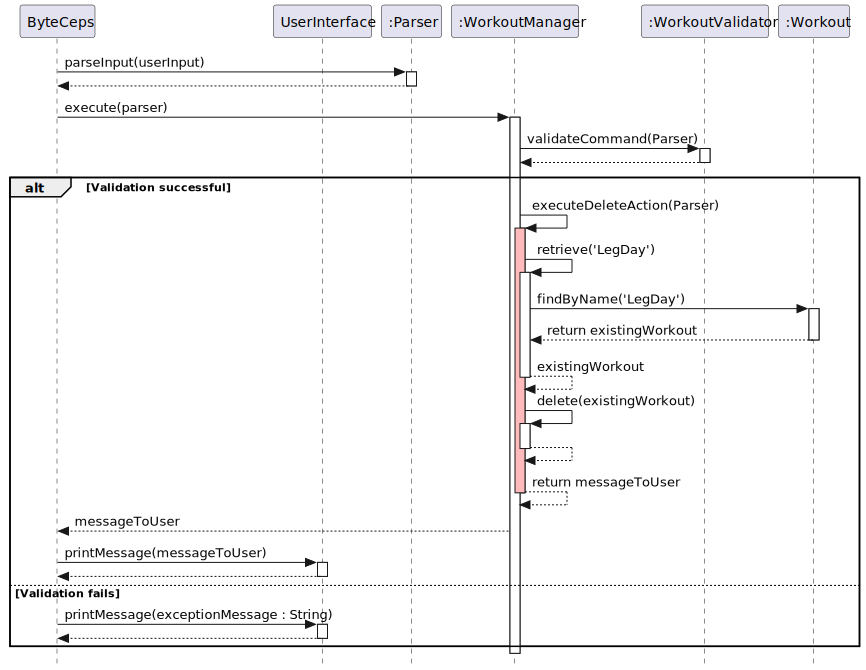

# Tay Jun Feng Vernon - Project Portfolio Page

## Project: ByteCeps
BYTE-CEPS is a CLI-based tool for setting and tracking fitness goals.
The user interacts with the tool using commands entered via the CLI interface. With BYTE-CEPS, they can compile a list of exercises, build custom workouts, assign workouts to a weekly schedule and log details of each exercise completed in each performed workout.

BYTE-CEPS is written in Java, and has approximately 5.6 kLoC.

## Summary of Contributions
### Code contributed
All code contributed can be seen on the tP dashboard
[here](https://nus-cs2113-ay2324s2.github.io/tp-dashboard/?search=&sort=groupTitle&sortWithin=title&timeframe=commit&mergegroup=&groupSelect=groupByRepos&breakdown=true&checkedFileTypes=docs~functional-code~test-code~other&since=2024-02-23&tabOpen=true&tabType=zoom&zA=V4Vern&zR=AY2324S2-CS2113-F14-3%2Ftp%5Bmaster%5D&zACS=132.79018044481745&zS=2024-02-23&zFS=&zU=2024-04-12&zMG=false&zFTF=commit&zFGS=groupByRepos&zFR=false)!

### Features implemented
#### New feature: Exercise Management System
- What it does: Implements the functionality for users to manage their exercises within BYTE-CEPS, including adding, deleting, listing, and searching for exercises.
- Justification: Enhances user experience by providing robust management tools, allowing users to tailor exercise lists to their needs, which is crucial for maintaining an organized fitness regimen.
- Commands Implemented
  - Add: `exercise /add <EXERCISE_NAME>`
  - Delete: `exercise /delete <EXERCISE_NAME>`
  - List: `exercise /list`
  - Search: `exercise /search <EXERCISE_NAME>`
- Highlights: Created comprehensive command interfaces for exercise management (Exercise & ExerciseManager.java). Worked on debugging and refining the editing functionality to ensure reliable user interactions.
- Credits: Utilized Java standard libraries extensively; no third-party libraries were heavily used.

#### New feature: Workout Management System
- What it does: Allows users to create, manage, and customize workout plans comprising various exercises, enhancing the planning of fitness activities within BYTE-CEPS.
- Justification: Provides essential functionality for users aiming to structure their fitness programs. It directly impacts user satisfaction by enabling more organized and accessible workout planning.
- Commands Implemented
  - Create: `workout /create <WORKOUT_PLAN_NAME>`
  - Delete: `workout /delete <WORKOUT_PLAN_NAME>`
  - Edit: `workout /edit <OLD_NAME> /to <NEW_NAME>`
  - Search: `workout /search <WORKOUT_PLAN_NAME>`
  - List: `workout /list`
  - Assign Exercise: `workout /assign <EXERCISE_NAME> /to <WORKOUT_PLAN_NAME>`
  - Unassign Exercise: `workout /unassign <EXERCISE_NAME> /from <WORKOUT_PLAN_NAME>`
  - Info: `workout /info <WORKOUT_PLAN_NAME>`
- Highlights: Implemented a system to create, edit, delete, and list workout plans, and manage their association with specific exercises (workout & WorkoutManager.java). Ensured flexibility and user-friendliness in workout plan management, such as case insensitivity and special character handling in plan names. Addressed challenges in linking exercises to workout plans, enabling dynamic updates and modifications, which involved intricate logic to maintain data integrity and user workflow.
- Credits: Leveraged Java collections framework for managing relationships between data entities; no third-party libraries were heavily used.

### Enhancements made
### Enhancement:  Logging Workouts with Multiple Sets and Weights
Functionality: Expanded the workout logging capabilities to support multiple sets with varying weights and repetitions for each exercise.
- Commands Updated:
  - Newly introduced functionality that allows logging multiple sets with different weights and repetitions.
  - Command: `program /log <EXERCISE_NAME> /weight <WEIGHT1 WEIGHT2 ...> /sets <NUMBER_OF_SETS> /reps <REPS1 REPS2 ...>`
  - Example: `program /log benchpress /weight 100 110 120 /sets 3 /reps 5 4 3`
  - Outcome: Logs benchpress with three sets at varying weights and reps, providing a detailed record of the workout performance on a given day.   

#### User Guide contributions
  - Authored the Exercise Management section of the UG
  - Authored the Workout Management section of the UG
  - Authored the Exit/Saving and Edit data section of the UG
  - Created a summary table of all commands

#### Developer Guide contributions
  - Added implementation details of all features of `Exercise Management`.
  - Added implementation details of all features of `Workout Management`.
  - Created sequence diagram of `addExercise` under `Exercise Management`.
  - Created sequence diagrams of `deleteWorkout`,`assignExerciseToWorkout`, `listExercisesinWorkoutPlan`  under `Workout Management`.
  - Added Product Scope Information (Target User Profile, Value Proposition, User Stories & Non-Functional Requirements) & Glossary
  - Added Instructions for manual testing

#### Added UML diagrams:
Sequence Diagram for addExercise:

Sequence Diagram for deleteWorkout:

Sequence Diagram for assignExerciseToWorkout:

Sequence Diagram for listExercisesinWorkoutPlan:

### Contributions to team-based tasks
- Setup issue tracker for V1.0 & V2.0
- Updating user/developer docs that are not specific to a feature e.g. documenting the target user profile
- Review PRs
- Increased code test coverage from 66% to 82%

### Contributions beyond the project team
* PE dry Run:
    * [Screenshot captured during PE dry run](https://github.com/V4vern/ped/tree/main/files)
* DG review for other teams:
    * [BookMarked](https://github.com/nus-cs2113-AY2324S2/tp/pull/19)
